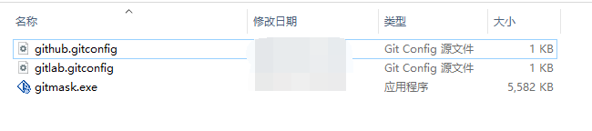
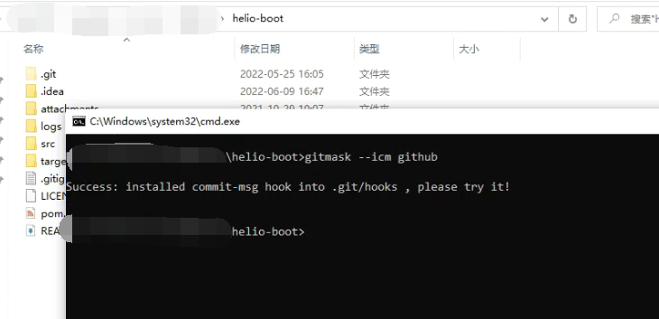

## 由来
偶尔提交代码到 Github 的时候错用了真名和公司邮箱，当然也有反过来的情况。
又遇到仓库不允许强制推送，导致不能偷偷摸摸洗掉提交记录……  
痛定思痛，干脆写个程序来尽量避免尴尬

## 支持系统
- Windows x86_64
- ~~Linux~~ (等待有缘人提 PR )
- ~~MacOS~~ (买不起，等待有缘人提 PR )

## 主要用法
> 这里直接用编译好的二进制程序来演示
### 1. 安装 GitMask 到系统 PATH
> 在 GitMask 可执行文件所在目录执行；一般只需执行一次
> 
> 安装后最好重启一下系统，生效成功率高
> 
> 如果 gitmask 自动化注册有问题，请在命令行执行 `echo %PATH%` 检查
#### 命令
```
gitmask --register
```
#### 成功响应
```
Backup PATH into PATH_BACKUP_20220610094527 ...

...

Success: registered GitMask into your system PATH
```

### 2. 准备好 .gitconfig 文件


### 3. 在目标目录安装 Git-commit 提交人检查钩子 ( [I]nstall [C]ommit-[M]sg hook )
#### 命令
```
gitmask --icm [指定 .gitconfig 文件名]
```
#### 例子

#### 成功响应
```
Success: installed commit-msg hook into .git/hooks , please try it!
```

## 如果想自己修改后，本地手动构建？(建议使用 Python 虚拟环境进行)
### Windows
```
pip install -r requirements_compile_win32.txt
pyinstaller gitmask.py --onefile -i resource/GitMask.ico
```

## 图标素材来源
https://www.iconfont.cn/collections/detail?cid=19760
https://www.iconfont.cn/collections/detail?cid=4388
